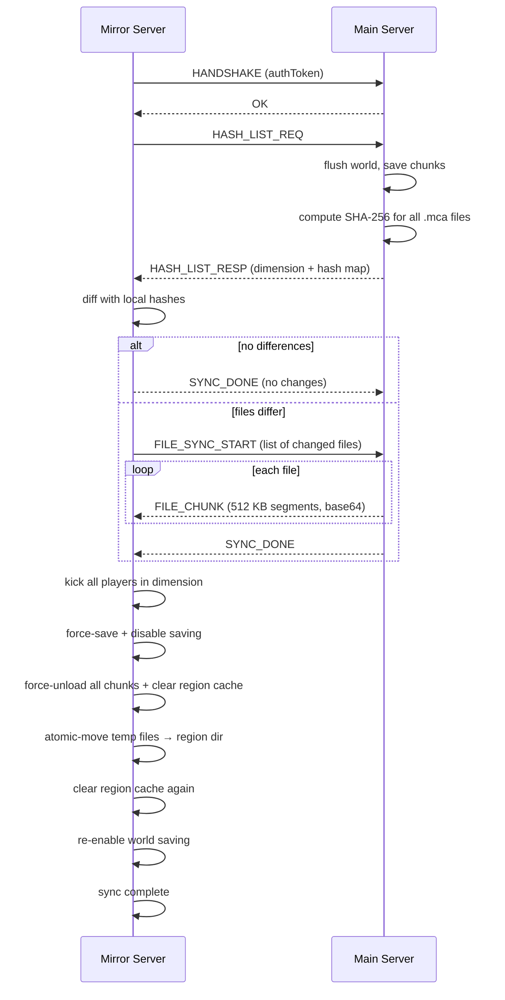

# Mirage

*A Minecraft Fabric mod for incremental, real-time dimension region synchronization between a main server and one or more mirror servers.*

[](https://minecraft.net)
[](https://fabricmc.net)
[](https://adoptium.net)
[](LICENSE)
[](https://github.com/MRNOBODY-ZST/Mirage/actions/workflows/build.yml)

[中文说明](README_zh.md)

---

## Features

| | |
|---|---|
| **Incremental Sync** | SHA-256 delta comparison transfers only changed `.mca` region files |
| **Netty TCP** | Persistent long-lived connection with automatic reconnection on the mirror side |
| **Atomic File Replace** | Write-to-temp-then-move ensures zero file corruption during sync |
| **Chunk-Level Precision** | Sync individual chunks via `/mirage sync chunk` / `/mirage pull chunk` |
| **Multi-Dimension** | Supports any registered Minecraft dimension (overworld, nether, end, custom) |
| **Online Sync** | Players are temporarily kicked only on the target mirror; main server stays online |
| **Auto-Sync** | Optional scheduled background sync on the mirror side (configurable interval) |
| **Cooldown Guard** | Built-in cooldown between syncs prevents accidental thundering-herd on servers |

---

## Architecture

```mermaid
flowchart LR
    subgraph Main["Main Server"]
        MS[ServerLevel<br/>world"]
        RH[RegionHasher<br/>SHA-256"]
        SS[MirageSyncServer<br/>Netty TCP :25566"]
        SM[MainServerTask<br/>broadcasts hashes"]
    end

    subgraph Mirror["Mirror Server"]
        MR[ServerLevel<br/>world"]
        DC[DeltaComparator<br/>diff"]
        FT[FileTransferManager<br/>atomic move"]
        SC[MirageSyncClient<br/>TCP client"]
        MA[MirrorApplyTask<br/>applies changes"]
    end

    MS -->|"flush + save"| RH
    RH -->|"hash map"| SS
    SS -.->|"HASH_LIST_RESP"| SC
    SC -->|"FILE_SYNC_START"| DC
    DC -->|"file list"| SS
    SS -.->|"FILE_CHUNK"| SC
    SC -->|"write temp .mca"| FT
    FT -->|"atomic move"| MR
    MA -->|"kick players"| MR
    MA -->|"clear cache"| MR
```

**Sync sequence** (mirror-initiated pull):



---

## Requirements

| Component | Version |
|-----------|---------|
| Minecraft | 1.21.11 |
| Fabric Loader | ≥ 0.18.4 |
| Fabric API | 0.141.3+1.21.11 |
| Java | ≥ 21 |

---

## Installation

1. **Build the mod**

   ```bash
   ./gradlew build
   ```

   The output jar is at `build/libs/mirage-<version>.jar`.

2. **Install on both main and mirror servers**
   - Place the jar into each server's `mods/` folder.
   - Both servers must run the same Minecraft version (1.21.11).

3. **First launch**
   - Start the server once. `config/mirage.json` is auto-generated.
   - Stop the server and edit the config (see below).
   - Restart the server.

---

## Configuration

Config file: `config/mirage.json`, created on first launch.

### Main server

```json
{
  "mode": "main",
  "syncCooldownSeconds": 30,
  "mainServer": {
    "port": 25566,
    "authToken": "replace-with-a-secure-random-string"
  }
}
```

### Mirror server

```json
{
  "mode": "mirror",
  "syncCooldownSeconds": 30,
  "mirrorServer": {
    "mainIp": "main-server-ip-or-hostname",
    "mainPort": 25566,
    "authToken": "replace-with-a-secure-random-string",
    "targetDimensions": [
      "minecraft:overworld"
    ],
    "autoSyncEnabled": false,
    "autoSyncIntervalMinutes": 30
  }
}
```

### Configuration fields

| Field | Default | Description |
|-------|---------|-------------|
| `mode` | `main` | Server role: `main` or `mirror` |
| `syncCooldownSeconds` | `30` | Minimum seconds between two sync operations |
| `mainServer.port` | `25566` | TCP port for sync listeners (main only) |
| `mainServer.authToken` | `change-me` | Must match the mirror's token exactly |
| `mirrorServer.mainIp` | `127.0.0.1` | Main server IP or hostname |
| `mirrorServer.mainPort` | `25566` | Main server sync port |
| `mirrorServer.authToken` | `change-me` | Must match the main server's token exactly |
| `mirrorServer.targetDimensions` | `[minecraft:overworld]` | Dimensions to sync on pull |
| `mirrorServer.autoSyncEnabled` | `false` | Enable automatic scheduled sync |
| `mirrorServer.autoSyncIntervalMinutes` | `30` | Interval between automatic syncs (minutes) |

> **Warning**: `authToken` must be identical on both servers — connections are rejected otherwise. Change the default value `change-me` to a secure random string before use.
>
> **Note**: Changes to network settings (`port`, `mainIp`, `mainPort`) require a server restart.

---

## Commands

All admin-level commands require permission level `OPERATORS`.

### Main server commands

| Command | Description |
|---------|-------------|
| `/mirage sync <dimension>` | Compute and broadcast the hash list for one dimension to all connected mirrors |
| `/mirage sync all` | Broadcast hash lists for all registered dimensions |
| `/mirage sync chunk <dimension> <x> <z>` | Broadcast a single chunk by block coordinates |
| `/mirage status` | Show mode, connected mirror count, sync state |
| `/mirage reload` | Reload `config/mirage.json` from disk |

### Mirror server commands

| Command | Description |
|---------|-------------|
| `/mirage pull <dimension>` | Pull one dimension from the main server |
| `/mirage pull all` | Pull all dimensions listed in `targetDimensions` |
| `/mirage pull chunk <dimension> <x> <z>` | Pull a single chunk by block coordinates |
| `/mirage status` | Show mode, connection state, sync state |
| `/mirage reload` | Reload `config/mirage.json` from disk |

> **Note**: Players in the target dimension on the mirror server will be kicked during sync.

---

## Project Structure

```
src/main/java/xyz/tofumc/
├── Mirage.java                         # Mod entrypoint, lifecycle
└── mirage/
    ├── command/
    │   └── MirageCommand.java          # /mirage command tree (brigadier)
    ├── config/
    │   ├── ConfigManager.java           # JSON config read/write
    │   └── MirageConfig.java            # Config POJO with defaults
    ├── hash/
    │   ├── RegionHasher.java            # SHA-256 all .mca files in a dimension
    │   ├── DeltaComparator.java         # Hash diff → files to download/delete
    │   └── FileTransferManager.java     # Chunked write + atomic move
    ├── network/
    │   ├── protocol/
    │   │   ├── MessageType.java        # Enum: HANDSHAKE, HASH_LIST_REQ, ...
    │   │   ├── MirageProtocol.java     # Binary encode/decode (ByteBuf codec)
    │   │   ├── MessagePayloads.java     # Record-based payload definitions
    │   │   └── MirageFrameDecoder.java # 4-byte big-endian length framing
    │   ├── server/
    │   │   ├── MirageSyncServer.java   # Netty NIO server, broadcast helper
    │   │   └── ServerHandler.java      # Server-side channel inbound handler
    │   └── client/
    │       ├── MirageSyncClient.java   # Netty TCP client, auto-reconnect
    │       └── ClientHandler.java      # Client-side channel inbound handler
    ├── sync/
    │   ├── SyncState.java              # Sync-in-progress flag + cooldown timer
    │   ├── MainServerTask.java         # Hash computation + broadcast
    │   ├── MirrorApplyTask.java        # Receive + apply files / in-memory chunk patch
    │   └── ScheduledSyncTask.java      # Auto-sync scheduling (mirror side)
    ├── util/
    │   ├── HashUtil.java               # SHA-256 digest wrapper
    │   ├── DimensionPathUtil.java      # Dimension ID → region/directory path
    │   ├── RegionFileUtil.java         # .mca filename, chunk offset, NBT I/O
    │   └── SyncLogger.java             # namespaced log helper
    └── world/
        ├── WorldSafetyManager.java     # kick players, force-save, save on/off
        └── ChunkUnloader.java          # unload chunks + clear region cache
```

---

## Build & Release

### Build locally

```bash
./gradlew build
```

Artifact: `build/libs/mirage-<version>.jar`

The version is read from `gradle.properties` (`mod_version`, currently **1.2.0**).

### CI/CD

| Workflow | Trigger | Action |
|----------|---------|--------|
| [`build.yml`](.github/workflows/build.yml) | Push to any branch / PR | `./gradlew build` → upload artifact |
| [`release.yml`](.github/workflows/release.yml) | Push tag `v*` | Bump `mod_version` in `gradle.properties` → `./gradlew build` → publish GitHub Release |

---

## Contributing

Bug reports and feature requests are welcome. Please open an issue before submitting a pull request.

### Development setup

```bash
git clone https://github.com/MRNOBODY-ZST/Mirage.git
cd Mirage
./gradlew build   # verify it compiles
```

---

## FAQ

**Q: Can I run multiple mirrors?**
Yes. The main server is a TCP server — any number of mirrors can connect simultaneously. Each mirror operates independently.

**Q: Does this mod act as a BungeeCord/Velocity proxy?**
No. Mirage only synchronizes world region files (`.mca`). It does not proxy player connections or chat. It is a **world synchronization tool**, not a proxy.

**Q: What happens to players during sync?**
On the **mirror** server, players in the syncing dimension are kicked with a message and may reconnect immediately (the world is fully saved and consistent). The **main** server continues to operate normally — players are not affected.

**Q: What if the sync is interrupted (e.g. network cut)?**
File transfer uses atomic temp-file-then-move. If interrupted mid-transfer, the mirror's world remains in its previous consistent state. No corruption occurs. Simply run `/mirage pull <dimension>` again after reconnecting.

**Q: Does Fabric API need to be installed separately?**
Fabric API is declared as a dependency in `fabric.mod.json` with `*` version, meaning it is required. Install it alongside Mirage in the `mods/` folder.

---

## License

**MIT License** — see [`LICENSE`](LICENSE).

---

*Mirage — TofuMC · Minecraft 1.21.11 · Fabric*
