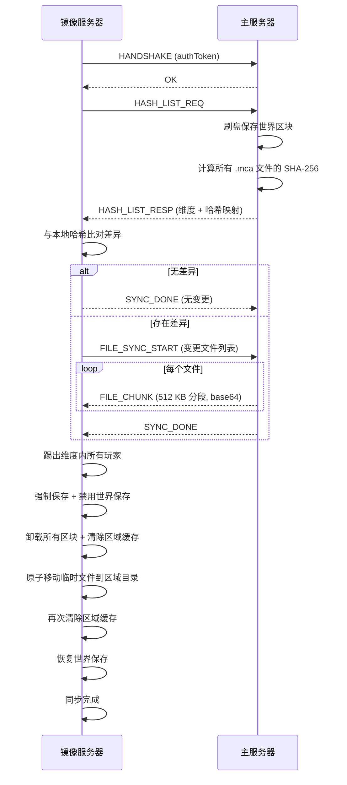

# Mirage

*一款 Minecraft Fabric 模组，用于在主服务器和一个或多个镜像服务器之间进行增量的、实时的维度区域同步。*

[](https://minecraft.net)
[](https://fabricmc.net)
[](https://adoptium.net)
[](LICENSE)
[](https://github.com/MRNOBODY-ZST/Mirage/actions/workflows/build.yml)

[English](README.md)

---

## 功能特性

| | |
|---|---|
| **增量同步** | SHA-256 差异比较，仅传输发生变化的 `.mca` 区域文件 |
| **Netty TCP** | 持久长连接，镜像端支持自动重连 |
| **原子文件替换** | 先写入临时文件再移动，保证同步过程零文件损坏 |
| **区块级精度** | 支持通过 `/mirage sync chunk` / `/mirage pull chunk` 同步单个区块 |
| **多维度支持** | 支持任何已注册的 Minecraft 维度（主世界、下界、末地、自定义维度） |
| **在线同步** | 玩家仅在目标镜像服被踢出；主服务器全程保持正常运作 |
| **自动同步** | 镜像端支持可选的定时自动同步（可配置间隔） |
| **冷却保护** | 内置同步冷却时间，防止服务器遭遇意外的同步风暴 |

---

## 架构设计

```mermaid
flowchart LR
    subgraph Main["主服务器"]
        MS[ServerLevel<br/>世界"]
        RH[RegionHasher<br/>SHA-256"]
        SS[MirageSyncServer<br/>Netty TCP :25566"]
        SM[MainServerTask<br/>广播哈希"]
    end

    subgraph Mirror["镜像服务器"]
        MR[ServerLevel<br/>世界"]
        DC[DeltaComparator<br/>差异计算"]
        FT[FileTransferManager<br/>原子移动"]
        SC[MirageSyncClient<br/>TCP 客户端"]
        MA[MirrorApplyTask<br/>应用变更"]
    end

    MS -->|"刷盘 + 保存"| RH
    RH -->|"哈希列表"| SS
    SS -.->|"HASH_LIST_RESP"| SC
    SC -->|"FILE_SYNC_START"| DC
    DC -->|"文件列表"| SS
    SS -.->|"FILE_CHUNK"| SC
    SC -->|"写入临时 .mca"| FT
    FT -->|"原子移动"| MR
    MA -->|"踢出玩家"| MR
    MA -->|"清除缓存"| MR
```

**同步时序**（镜像端拉取模式）：



---

## 环境要求

| 组件 | 版本 |
|------|------|
| Minecraft | 1.21.11 |
| Fabric Loader | ≥ 0.18.4 |
| Fabric API | 0.141.3+1.21.11 |
| Java | ≥ 21 |

---

## 安装步骤

1. **构建模组**

   ```bash
   ./gradlew build
   ```

   输出文件位于 `build/libs/mirage-<version>.jar`。

2. **在主服务器和镜像服务器上安装**
   - 将 jar 文件放入各服务器 `mods/` 目录。
   - 两台服务器必须运行相同的 Minecraft 版本（1.21.11）。

3. **首次启动**
   - 启动一次服务器，`config/mirage.json` 会自动生成。
   - 关闭服务器并编辑配置文件（见下文配置章节）。
   - 重新启动服务器。

---

## 配置说明

配置文件：`config/mirage.json`，首次启动时自动生成。

### 主服务器配置

```json
{
  "mode": "main",
  "syncCooldownSeconds": 30,
  "mainServer": {
    "port": 25566,
    "authToken": "请替换为安全的随机字符串"
  }
}
```

### 镜像服务器配置

```json
{
  "mode": "mirror",
  "syncCooldownSeconds": 30,
  "mirrorServer": {
    "mainIp": "主服务器 IP 或主机名",
    "mainPort": 25566,
    "authToken": "请替换为安全的随机字符串",
    "targetDimensions": [
      "minecraft:overworld"
    ],
    "autoSyncEnabled": false,
    "autoSyncIntervalMinutes": 30
  }
}
```

### 配置字段说明

| 字段 | 默认值 | 说明 |
|------|--------|------|
| `mode` | `main` | 服务器角色：`main`（主服务器）或 `mirror`（镜像服务器） |
| `syncCooldownSeconds` | `30` | 两次同步操作之间的最小间隔（秒） |
| `mainServer.port` | `25566` | 同步监听 TCP 端口（仅主服务器） |
| `mainServer.authToken` | `change-me` | 必须与镜像服务器配置完全一致 |
| `mirrorServer.mainIp` | `127.0.0.1` | 主服务器 IP 地址或主机名 |
| `mirrorServer.mainPort` | `25566` | 主服务器同步端口 |
| `mirrorServer.authToken` | `change-me` | 必须与主服务器配置完全一致 |
| `mirrorServer.targetDimensions` | `[minecraft:overworld]` | 拉取时要同步的维度列表 |
| `mirrorServer.autoSyncEnabled` | `false` | 启用自动定时同步 |
| `mirrorServer.autoSyncIntervalMinutes` | `30` | 自动同步间隔（分钟） |

> **警告**：`authToken` 必须在主服务器和镜像服务器上完全一致，否则连接会被拒绝。请在使用前将默认值 `change-me` 替换为安全的随机字符串。
>
> **注意**：修改网络相关配置项（`port`、`mainIp`、`mainPort`）后需要重启服务器才能生效。

---

## 命令参考

所有管理员级命令要求权限等级为 `OPERATORS`。

### 主服务器命令

| 命令 | 说明 |
|------|------|
| `/mirage sync <维度>` | 计算并向所有已连接的镜像服务器广播指定维度的哈希列表 |
| `/mirage sync all` | 广播所有已注册维度的哈希列表 |
| `/mirage sync chunk <维度> <x> <z>` | 按方块坐标广播单个区块 |
| `/mirage status` | 显示当前模式、已连接镜像数量、同步状态 |
| `/mirage reload` | 从磁盘重新加载 `config/mirage.json` |

### 镜像服务器命令

| 命令 | 说明 |
|------|------|
| `/mirage pull <维度>` | 从主服务器拉取指定维度 |
| `/mirage pull all` | 拉取 `targetDimensions` 中配置的所有维度 |
| `/mirage pull chunk <维度> <x> <z>` | 按方块坐标拉取单个区块 |
| `/mirage status` | 显示当前模式、连接状态、同步状态 |
| `/mirage reload` | 从磁盘重新加载 `config/mirage.json` |

> **注意**：同步期间，位于目标维度内的玩家会被踢出服务器。

---

## 项目结构

```
src/main/java/xyz/tofumc/
├── Mirage.java                         # 模组入口, 生命周期管理
└── mirage/
    ├── command/
    │   └── MirageCommand.java          # /mirage 命令树 (brigadier)
    ├── config/
    │   ├── ConfigManager.java           # JSON 配置文件读写
    │   └── MirageConfig.java            # 配置 POJO，含默认值
    ├── hash/
    │   ├── RegionHasher.java            # 对维度内所有 .mca 文件计算 SHA-256
    │   ├── DeltaComparator.java         # 哈希差异 → 待下载/待删除文件列表
    │   └── FileTransferManager.java     # 分块写入 + 原子移动
    ├── network/
    │   ├── protocol/
    │   │   ├── MessageType.java        # 消息类型枚举: HANDSHAKE, HASH_LIST_REQ, ...
    │   │   ├── MirageProtocol.java     # 二进制编码/解码 (ByteBuf codec)
    │   │   ├── MessagePayloads.java     # 基于 record 的消息载荷定义
    │   │   └── MirageFrameDecoder.java # 4 字节大端长度帧解码
    │   ├── server/
    │   │   ├── MirageSyncServer.java   # Netty NIO 服务器, 广播辅助方法
    │   │   └── ServerHandler.java      # 服务器端 Channel 入站处理器
    │   └── client/
    │       ├── MirageSyncClient.java   # Netty TCP 客户端, 自动重连
    │       └── ClientHandler.java      # 客户端 Channel 入站处理器
    ├── sync/
    │   ├── SyncState.java              # 同步进行中标志 + 冷却计时器
    │   ├── MainServerTask.java         # 哈希计算 + 广播
    │   ├── MirrorApplyTask.java        # 接收并应用文件 / 内存区块热补丁
    │   └── ScheduledSyncTask.java      # 自动同步定时调度 (镜像端)
    ├── util/
    │   ├── HashUtil.java               # SHA-256 摘要封装
    │   ├── DimensionPathUtil.java      # 维度 ID → region 目录路径转换
    │   ├── RegionFileUtil.java         # .mca 文件名、块偏移、NBT 读写
    │   └── SyncLogger.java             # 带命名空间的日志辅助类
    └── world/
        ├── WorldSafetyManager.java     # 踢出玩家、强制保存、保存开关
        └── ChunkUnloader.java          # 卸载区块 + 清除区域缓存
```

---

## 构建与发布

### 本地构建

```bash
./gradlew build
```

产物位置：`build/libs/mirage-<version>.jar`

版本号从 `gradle.properties` 中的 `mod_version` 读取（当前版本 **1.2.0**）。

### 持续集成 / 持续部署

| 工作流 | 触发条件 | 操作 |
|--------|----------|------|
| [`build.yml`](.github/workflows/build.yml) | 推送至任意分支 / PR | `./gradlew build` → 上传构建产物 |
| [`release.yml`](.github/workflows/release.yml) | 推送 `v*` 标签 | 更新 `gradle.properties` 中的 `mod_version` → `./gradlew build` → 发布 GitHub Release |

---

## 贡献指南

欢迎提交 Bug 报告和功能请求。提交 Pull Request 前请先开一个 Issue 讨论。

### 开发环境搭建

```bash
git clone https://github.com/MRNOBODY-ZST/Mirage.git
cd Mirage
./gradlew build   # 验证编译通过
```

---

## 常见问题

**Q: 可以同时运行多个镜像服务器吗？**
可以。主服务器是一个 TCP 服务器，任意数量的镜像服务器可以同时连接。每个镜像服务器独立运行，互不干扰。

**Q: 这个模组是 BungeeCord / Velocity 代理吗？**
不是。Mirage 只会同步世界区域文件（`.mca`），不会代理玩家连接或聊天。它是一个**世界同步工具**，不是代理。

**Q: 同步期间玩家会发生什么？**
在**镜像服务器**上，位于同步维度内的玩家会被踢出并收到提示消息，可以立即重连（此时世界已完全保存，状态一致）。**主服务器**不受影响，所有玩家正常游戏。

**Q: 如果同步过程中断（如网络断开）会怎样？**
文件传输使用原子性的"先写临时文件再移动"机制。如果传输中途被中断，镜像服务器的世界仍保持上一次的一致状态，不会有任何损坏。重新连接后重新运行 `/mirage pull <维度>` 即可。

**Q: 需要单独安装 Fabric API 吗？**
`fabric.mod.json` 中将 Fabric API 声明为必选依赖（版本 `*`）。请将 Fabric API 和 Mirage 一起放入 `mods/` 目录。

---

## 许可证

**MIT License** — 详见 [`LICENSE`](LICENSE)。

---

*Mirage — TofuMC · Minecraft 1.21.11 · Fabric*
